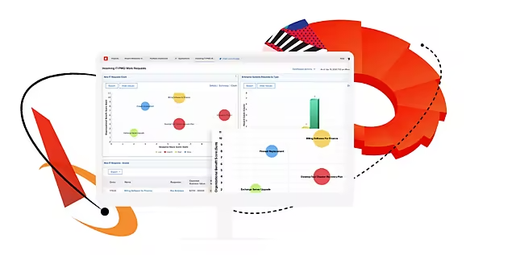

# Configuraciones de integración para aplicaciones de Adobe Experience Cloud: por solución

Esta sección ayudará a cualquier persona que tenga una necesidad empresarial, pero que no esté segura de qué productos de Adobe utilizar y cómo integrarlos.  Hemos organizado muchas de las configuraciones de integración más comunes para los productos empresariales de Adobe por categorías de soluciones.  Tenga en cuenta que hay muchas formas de configurar los productos de Adobe según su entorno.  La intención de esta sección es proporcionar directrices que puede implementar tal cual o modificar para satisfacer las necesidades de su entorno.

<table>
<tr>
    <td>
      
      
<strong><a href="./b2b.md">Marketing B2B</a></strong>

      

        Automatización de marketing y asociación de ventas
      

    </td>
   <td>
      
      
<strong><a href="./commerce.md">[!DNL Commerce]</a></strong>

      

        Comercio digital B2B y B2C
      

   </td>    
   <td>
      
      
<strong><a href="./content-management.md">Administración de contenido</a></strong>

      

        Administración de recursos y contenido
      

   </td>
</tr>
<tr>
   <td>
      
      
<strong><a href="./content-supply-chain.md">Cadena de suministro de contenido</a></strong>

      

        Acelerar la creación y entrega de contenido
      
 
    </td>
   <td>
      
      
<strong><a href="./customer-journeys.md">Recorridos del cliente</a></strong>

      

        Organización y entrega omnicanal
      
 
    </td>
   <td>
      
      
<strong><a href="./data-insights.md"> Información de datos y activación</a></strong>

      

        [!DNL Analytics] y gestión de público
      

   </td>  
</tr>
<tr>
   <td>
      
      
<strong><a href="./personalization.md">Personalización como escala</a></strong>

      

        Cómo convertir cada conexión en personal
      

   </td>
</table>
